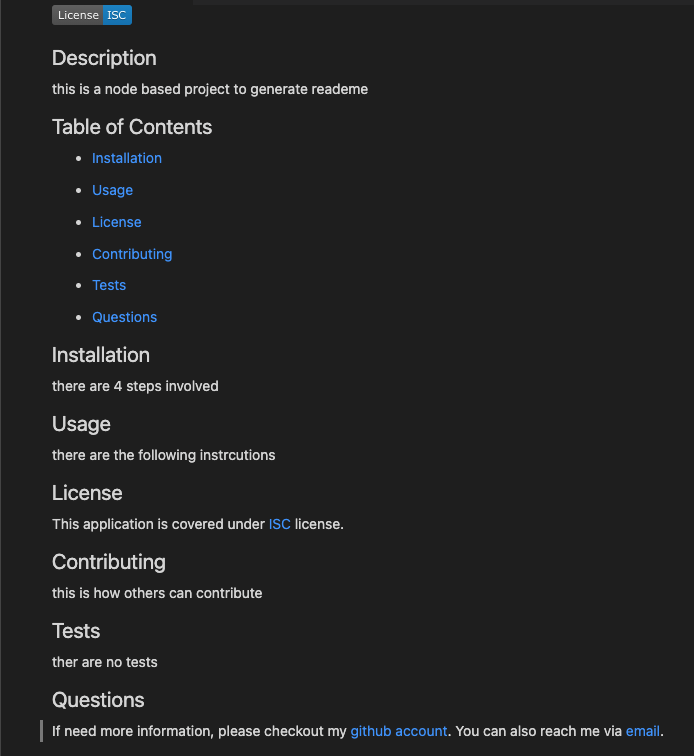

# README Generator


## [Walkthrough Video](https://drive.google.com/file/d/1CwH0_oSXynpap8AZAd2vQItUpwD6IzT2/view)

## [GitHub Url](https://github.com/harry-100/README-generator)

## Description

This is a Node based app to create a high quality, professional looking README. It generates README file dynamically based on the inputs provided by the user. It uses 'inquirer package' to capture user input. The application can be invoked by using the following command on terminal
``` 
node index.js 
```

## Table of Contents


* [Usage](#Usage)

* [License](#License)
* [ScreenShots](#ScreenShots)  
* [Questions](#Questions)

## Installation
there are 4 steps involved

## Usage
there are the following instrcutions


  ## License
  This application is covered under [MIT](
      https://opensource.org/licenses/MIT
      ) license.
 
 ## ScreenShots


)


## Questions
If need more information, please checkout my [github account](https://github.com/harry-100). You can also reach me via [email](mailto:harvinder.shah@gmail.com?subject=README Generator).